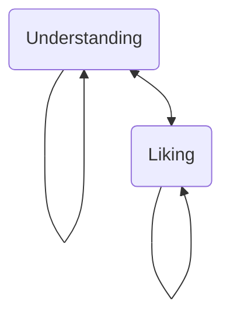
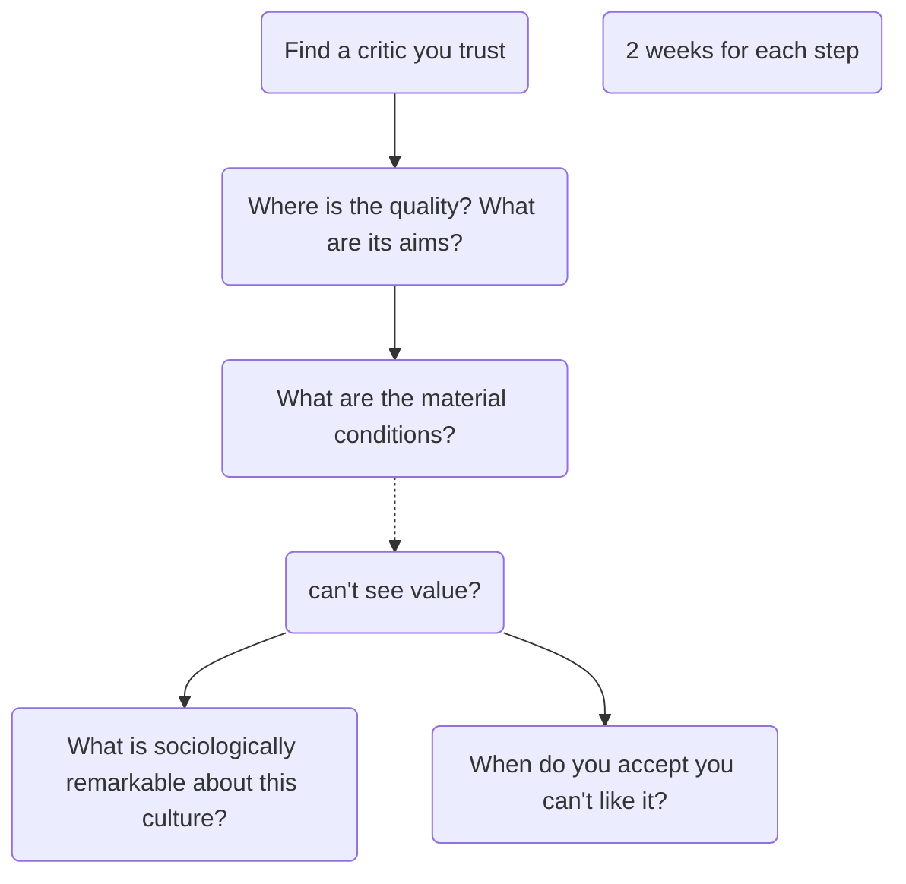

# Cracking cultural codes
## Key ideas
You can understand most cultures if you try!

...to some extent

**Components of a culture**
1) Canon - Alluded to
2) Jargon - ↑ efficiency, keeps out [[outgroup]]
3) Conventions, vocabulary, techniques
4) Material conditions - what is required to produce thing?
5) Originality, deviance, substyles, greatness

you can (should?) proceed through these in rough order

**Method for infiltrating a culture**

