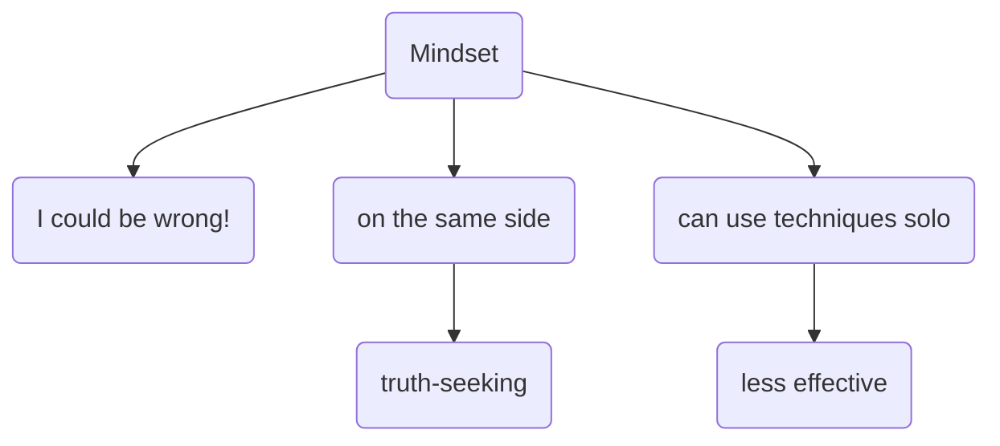

# Double Crux
## Key ideas
* A collaborative truth-seeking dialogue
* Understand yours and others' beliefs better
## What is a double crux?
$$Iff:$$
$$P -> C$$
$$¬P \implies ¬C$$
$$P = double\ crux$$

![[Pasted image 20210829120353.png]]
keystone
![[Pasted image 20210829120455.png]]
wheel spoke
![[Pasted image 20210829120538.png]]
building foundation

e.g. animals suffer -> morally impermissible to eat animals
animals do not suffer -> morally permissible to eat animals

The question of whether animals suffer or not is a double crux. 

You can have multiple cruxes, perhaps with one foundational crux.

**How to double crux**
- Paraphrase ("What I think you said was...")
- Operationalise ("What do you mean by X?")
- Pause and think

**Takeaways from practice**
- hard to identify your own cruxes
- hard to respond to their point, rather than related points
	- listening/paraphrasing helps
- focus on concepts or assumptions

