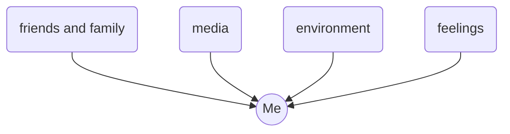
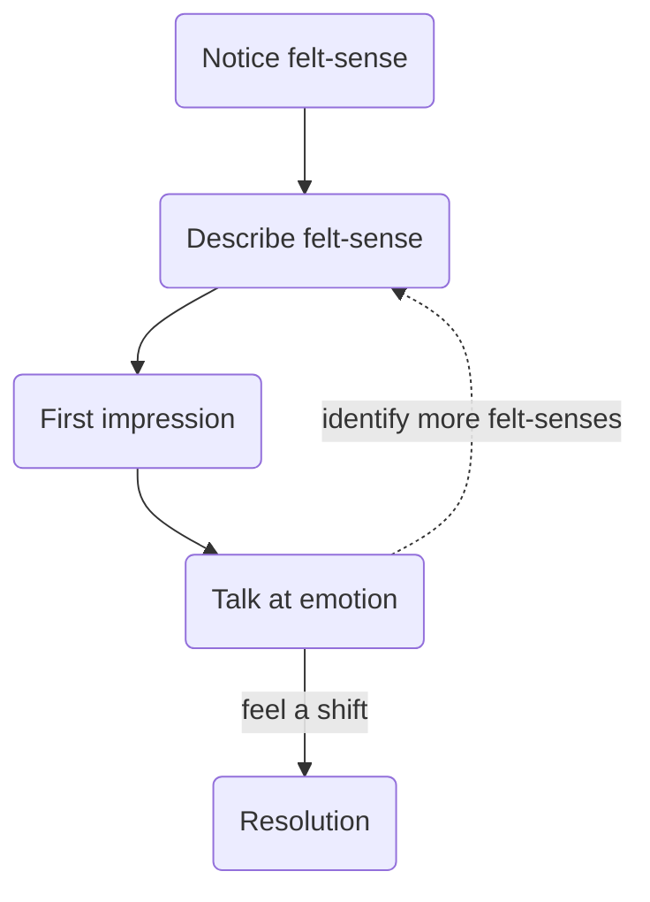

## Key ideas

- The king metaphor - how do you communicate with your feelings advisor?
- Useful for [[goal factoring]] and [[Inner Simulator]]
- A way of pulling out stored information
- See [[internal family systems]]

**The process**

## In detail
**Notice felt-sense:**
- point to where it is in your body

**Describe felt-sense:**
- be specific
- use metaphors
- e.g. tension in shoulders, rock in stomach

**First impression**
- "is it on your side or against you?"
- self-destructive -> likely against
- just a gut check, you can talk at and change your mind

**Talk at**
- offer an explanation or root cause
- "my tension in my shoulders is X, caused by Y..."
- see if your feeling changes
- if more come up, return to description

**Feel a shift** once identified

**Resolution**
- "thank you"
- "I appreciate you"
- "I commit to doing X for you"
- "I will look out for Y"

[[questions about focusing]]