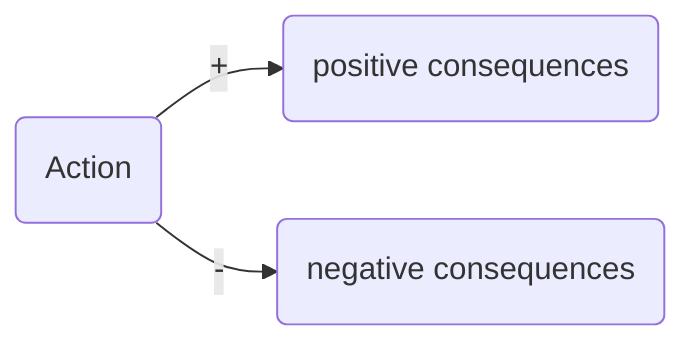

# Goal factoring
## Key ideas
* Action neutral, consequence centred
* List the positive and negative consequences of an action
* Try and identify alternatives that meet positive consequences and minimise negative consequences

## Process
1) Action
2) Consequences (P and N)
3) Evaluate
	1) Importance - is this consequence a crux?
	2) Completeness - are these all the relevant consequences? am I being honest with myself?
	3) Chance * value of consequences = expected value
4) Alternatives (that satisfy positive consequences)

	

