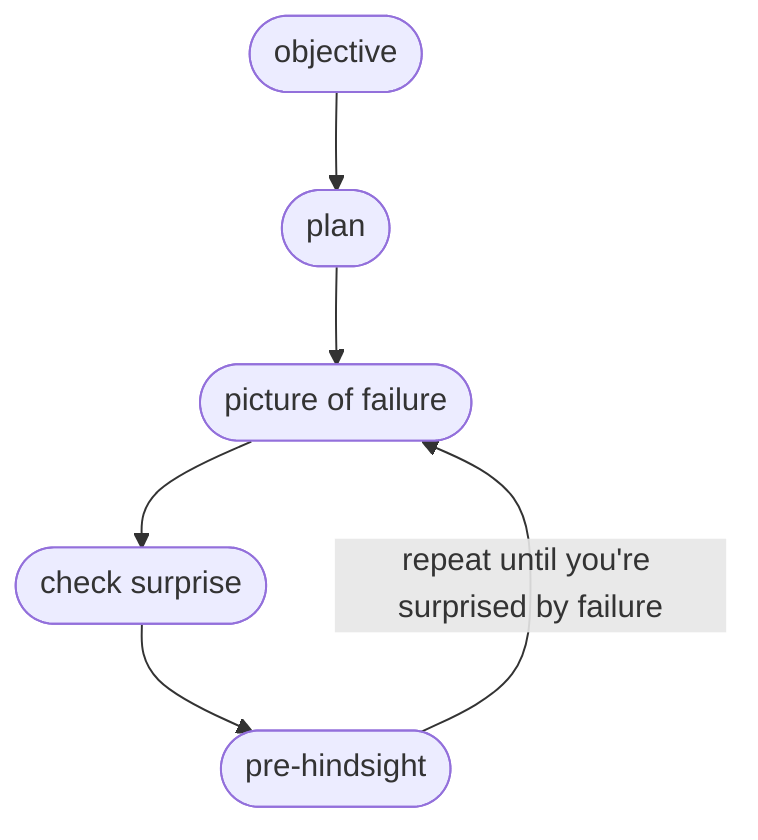

# Inner Simulator
## Key ideas:
- the inner simulator is the process projecting yourself into an imagined scenario, based on your past experiences and mental model of the situation
- you can use IS to check plans, surprisingness of failure, and practice pre-hindsight

## Planning Algorithm

| IS is: | IS is not: |
| :--- | :--- |
|  non verbal |   |
| uses sensory data | abstract |
| based on your best model of the world | imaginary |

## More details on the planning algorithm
Plan should include success criteria
Picture of failure is a specific situation in which you failed, e.g. being awake at 2am for someone who's trying to go to sleep before midnight.
Check surprise means asking yourself if you're surprised by failing. If not, then debug your plan and repeat.
Pre-hindsight is similar to the idea of a pre-mortem.

[[personal questions]]
[[personal examples of inner simulator]]