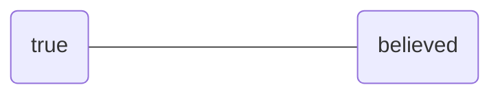

# Lines of retreat
## Key ideas
- Sometimes we flinch away from the idea of being wrong about a strongly held belief
- If A is a strongly held belief, plan for a world where ¬A is true
- This makes it easier to believe ¬A

e.g. covid-19, to make it easier to believe "a pandemic is about to hit" you might prepare for that world by stocking up on important supplies

Minimise the distance A-B in either direction

## What are lines of retreat helpful for?
Thinking about **wants**, i.e. 'what would I do if I wanted X'. Sometimes it's uncomfortable to consider wanting X
	- e.g. breaking up with your partner

Can you accept wanting something and not getting it?

## Creating distance
Imagine a character in a book facing the same problem. How would you solve it for them?

[[Questions about lines of retreat]]

