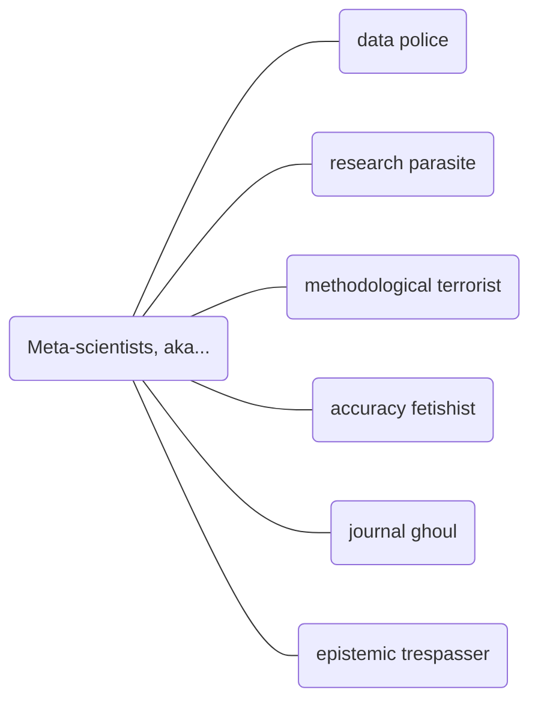

# Replication crisis
See slides [here](https://docs.google.com/presentation/d/12TbEhDZA6inWcVWeme6x8jhDRXcZoJ9B63DWG92lryY/edit?usp=sharing).

## Key ideas
Yikes, our results aren't reproducible!

## How replicability is tested
- Same hypothesis
- Same method = direct replication
- Similar method = conceptual replication
- Test for direction of effect only

e.g. if S1 found a 100x effect and S2 found a 2x effect, the results of S1 were successfully replicated.

## Statistical definitions
$$ P\ value = P(data\ is\ like\ this\ or\ more\ extreme\ |\ H_0)$$
$$ P\ value \neq \ the \ chance \ of \ being \ wrong$$

**Cohen's d**: distance between the means of 2 populations, measured in standard deviation

The Cohen's d for anti-depressants (which are pretty effective!) is about 0.33

## Scary facts
70% of psychology and 40% of economics does not replicate.

## What makes science more trustworthy?
- Multiverse analysis
- Pre-registration: state your hypothesis, method, sample size, etc, before Doing Science
- Base rate weight
- Uncertainty on d

If you have questions ask Gavin, I just copied this down

## How might we fix this?
- Pre-registration
- Post-publication peer review: all science is published and then publicly criticised
- Red Teams (undergraduates trying to replicate famous results)
- Learn how to read papers/outsource

