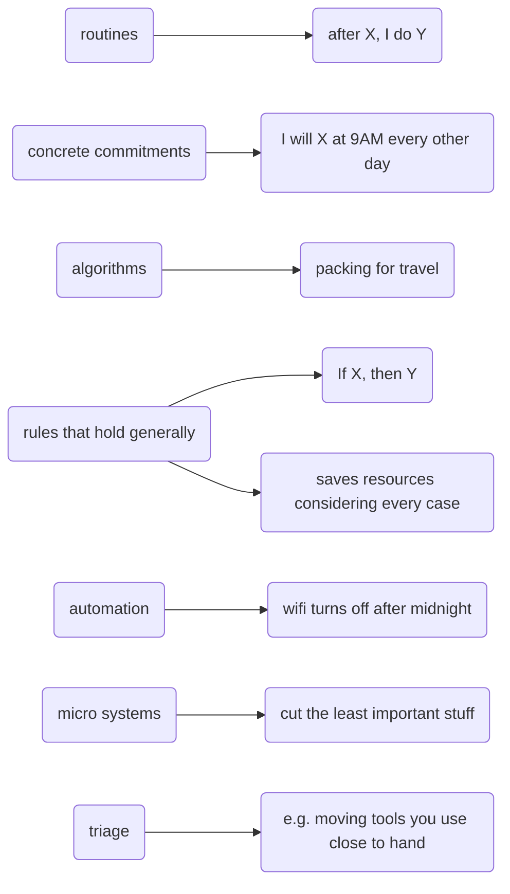
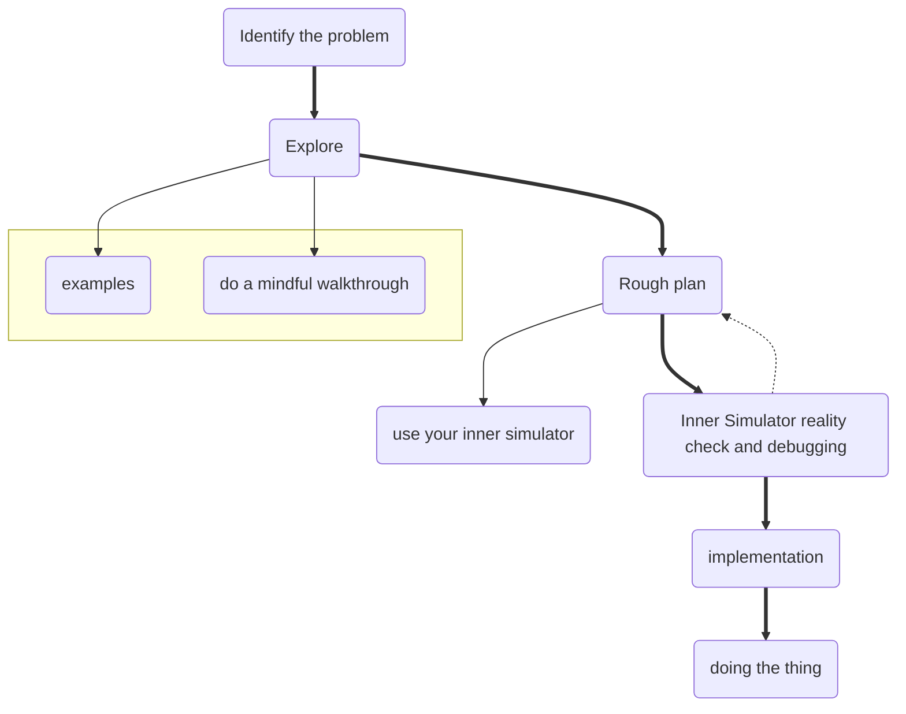
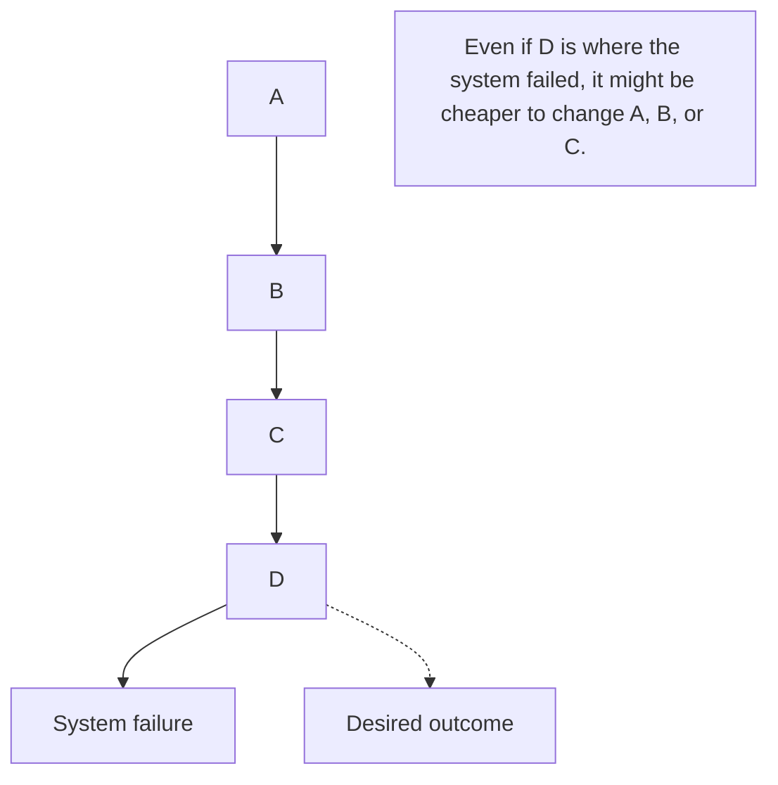

# Systems and routines
## Key ideas
* Default actions are the ones we take when we're low on energy/willpower/care
* You can identify and change them by building better systems and routines
* Don't put energy where it's unhelpful - **wasted motion**
* Notice the energy required for actions you want to take and decrease it

## Examples

## The process

## How to identify problems
- bottlenecks 🍾
- things you need
- significant inefficiencies
- where you're spending willpower

All systems fail. The aim is to *predict* when systems will fail and *plan* to rebuild them. Try to **look upstream** and build a causal chain. What went wrong? Where is the lowest cost point to intervene in?

A **mindful walkthrough** is like the [[Inner Simulator]], but for past events. Walk through where your system failed. How can you most easily fix it?

## What makes a good system?
- Effort ≈ 0
- Reliable

## How can you build reliable systems?
- make routines sacred
- minimise points of failure
- keep as simple as possible
	- automate
	- batch
- use friction to your advantage

**Examples:**
- Morning runners who sleep in their running clothes
- Automatically turning off your phone's wifi at the library
- Batching life admin to a specific hour once a week
- Putting healthy snacks on the counter and less healthy ones at the back of a cupboard
- To do list widget on phone screen

## On not expecting success
By default, all systems fail. Don't feel bad about it and don't expect to succeed.

Using a reverse [[Inner Simulator]] can help calibrate your expectations and minimise the pain of failure. Ask "would I be surprised if I succeeded on my first try?" 

