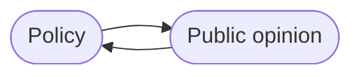

# What's Stopping You?
I didn't take notes on the class structure. These are some ideas discussed during our class. 

**Role of individuals:**
- Influence public opinion through media (books, podcasts, Youtube)
- Changemakers in policy
	- a powerful minority can drive change

## When to act?
- Investing to build up money, waiting to get a better idea of where to move - patient philanthropy
- Tradeoff between planning and direct action
- Fail fast

## How do you know you have enough agency?
- Working on (your) most important problems
- Failing a lot
	- Evie's failure log
- Feeling uncomfortable, challenged
- Accumulating rejections

Doing too much decreases the resources you can devote to each project. But some diversity is probably better:
- less risky (eggs in many baskets)
- new perspectives on different problems
- variety keeps things interesting

## What do you need?
- Around agenty people
- Introductions
- Mentors
- Accountability partners, fellow learners
- Systems for success (see Neel's classes)
	- Focusmate?
- Internships
- Time and energy
- Money?
	- grants
- Change of mindset
	- Confidence?
	- Success spirals
	- constrained by beliefs about self
	- you don't need permission to try things

Doing things is a skill that improves with practice